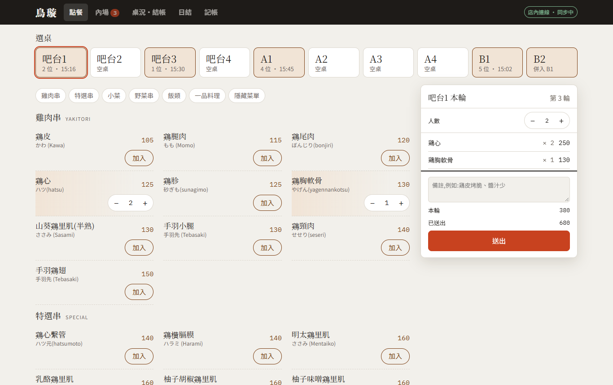
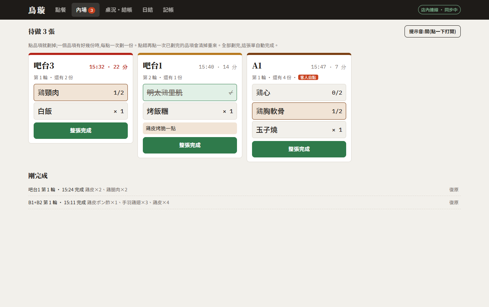
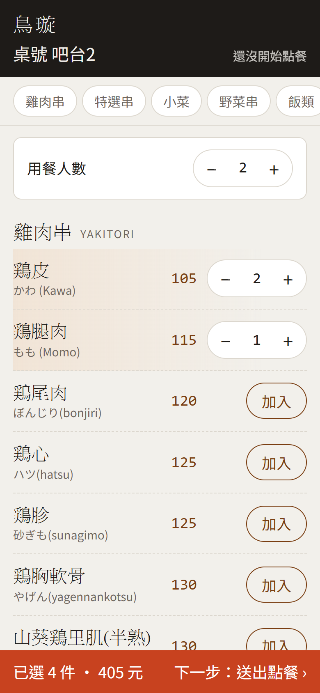
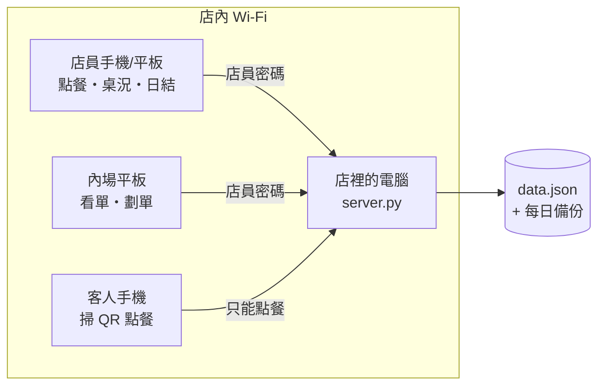

# 鳥璇點餐系統

一間串燒店從**手寫點菜單**換成**手機點餐 + 內場即時出單 + 客人掃碼自點**的店內系統。

跑在店裡的一台 Windows 電腦上,店員手機、內場平板、客人手機連同一個 Wi-Fi 就能用。
**不需要網路、不需要帳號、沒有月費**;店家拿到的是一個 exe,按兩下就開始營業。

| 外場點餐 | 內場看單、劃單 | 客人掃碼點餐 |
|---|---|---|
|  |  |  |

> 截圖裡的桌況、訂單、營業額都是示範資料。

---

## 要解決的問題

店裡原本全部用手寫單。店家希望換成系統之後能做到:

- **內場即時看單**:外場點了什麼,內場馬上看到;做好的品項能直接在單上劃掉
- **點錯能改**:點錯、多點的品項要能刪;客人併桌要能直接合併,併錯也要能拆回來
- **客人自己點**:客人用自己的手機掃桌上的 QR code 點餐,送出後直接進系統
- **結帳與打烊**:結帳能印明細給客人對帳;打烊能日結、點鈔;平常買食材的支出也能記下來
- **不增加負擔**:不用登入任何帳號,在店裡的另一台電腦就能用

## 功能

| 分頁 | 做什麼 |
|---|---|
| **點餐** | 選桌 → 開桌 → 點品項 → 送出。支援備註、分輪加點、**隱藏菜單**(店員自己輸入品名和價格,0 元 = 招待) |
| **內場** | 送出的單 1~2 秒內出現。點品項就劃掉,多份逐份劃(1/3、2/3…),全劃完自動完成;等太久變黃/變紅;新單提示音 |
| **桌況・結帳** | 每桌目前金額;退一份 / 整輪退;改人數、開瓶費;**換桌、併桌、拆桌**(電腦可以直接用滑鼠拖桌子併桌);列印明細 |
| **日結** | 營業額、來客數、客單價、收款方式、品項銷量;點鈔比對應收現金、關帳封存成日報 |
| **記帳** | 記支出(食材、炭火、耗材…),從收銀機拿的現金點鈔時自動扣除;月收支、食材佔營業額 |
| **客人掃碼點餐** | 每桌一張 QR code,客人自己點、自己送出,單上標「客人自點」;可看自己點過什麼、做到哪 |

更多截圖:[桌況與結帳](docs/screenshots/03-floor-bill.png) · [日結](docs/screenshots/04-daily-close.png) · [桌號 QR code](docs/screenshots/05-qr-codes.png) · [客人確認送出](docs/screenshots/07-guest-confirm.png) · [客人已點的餐點](docs/screenshots/08-guest-ordered.png)

## 架構



- `app/server.py`:只用 Python 標準函式庫的 HTTP 伺服器,資料存成一個 JSON 檔
- `app/index.html`:店員端(點餐、內場、桌況、日結、記帳),單一 HTML 檔,不依賴外部套件
- `app/guest.html`:客人端點餐頁
- 各裝置每 1.5 秒問一次伺服器有沒有新資料;沒變時伺服器只回一個版本號

## 設計上的取捨

**為什麼跑在店裡的電腦,不放雲端?**
店家的條件是「不用登入任何帳號」、「在店裡的另一台電腦就能用」。放在店內電腦上不需要帳號、沒有主機月費,外面網路斷了店裡照常點餐。代價是客人必須連店內 Wi-Fi,這點寫進了使用說明和 QR code 上。

**為什麼只用標準函式庫、打包成單一 exe?**
導入現場是店家的一般電腦,不會有人幫忙裝 Python。少一個套件就少一個出錯點。

**客人和店員是兩個頁面,店員端要密碼**
客人連的是同一個 Wi-Fi,技術上看得到店員頁。所以營業資料和所有修改都要店員密碼(店裡那台電腦本身免密碼),連錯 8 次鎖 10 分鐘。客人端只開放三個 API:看菜單、看自己這桌、送單。

**價格由伺服器算,不信任前端**
客人送單只送「品項 id + 數量」,名稱和價格由伺服器照菜單重算;不存在的品項、不合理的數量直接拒絕。同一支手機 3 秒內不能連續送單,擋手滑連按。

**菜單只有一個來源**
菜單寫在 `index.html` 一個地方,伺服器啟動時從那裡讀,客人頁再跟伺服器要。改菜單不會發生「店員端改了、客人端還是舊價格」。

**訂單跟著「這次開桌」走,不是跟著桌號走**
每次開桌產生一個 session id,訂單掛在 session 上。換桌只要搬桌子資料;併桌時把被併那桌的 session、人數、訂單記下來,拆桌才能完整還原。

**其他細節**
- 營業日切在清晨 5 點,過午夜的單仍算當天
- 退菜不刪除,劃線保留「退 1」,事後對帳查得到
- 資料先寫暫存檔再換名,寫到一半斷電不會壞檔;每天自動備份,保留 60 天
- 同一天關帳兩次會合併成同一筆日報,不會蓋掉

## 依店家回饋做的調整

上線後依店家實際使用的回饋改過的地方(節錄):

| 店家說 | 改成 |
|---|---|
| 結帳先照菜單價格就好,不要自動加低消 | 拿掉低消的顯示與加收,結帳 = 菜單價格 + 開瓶費 |
| 不用開帳、不用零用金 | 拿掉開帳流程,點鈔只比對「現金收款 − 收銀機支出」 |
| 不要登入、要在另一台電腦用 | 從雲端網頁版改成店內伺服器 + 單一 exe |
| 開桌人數預設 1 位 | 預設改為 1 |
| 吧台 5 用不到 | 桌位改成吧台 1–4、A1–A4、B1–B2 |
| 客人併桌要能直接拖、併錯要能拆 | 加入拖曳併桌、換桌、拆桌(還原原本的人數與訂單) |
| 點錯、多點的單要能刪 | 退一份、整輪退,並同步劃掉內場的單 |
| 內場要即時看到單、能劃單 | 內場分頁:即時出單、逐份劃單、剛完成可復原 |
| 客人要能自己點 | 加入客人掃碼點餐與桌號 QR code |
| 點餐的桌號放大、不要粗體;客人頁字放大、加入按鈕放價格旁邊、送出按鈕寫清楚 | 調整字級與版面,按鈕改成「下一步:送出點餐」 |

## 執行

```bash
# 需要 Python 3.10 以上,不用裝任何套件
python app/server.py
```

- 這台電腦:<http://localhost:8800>(免密碼)
- 其他裝置:<http://電腦IP:8800>,第一次要輸入店員密碼(第一次啟動時自動產生,存在 `app/設定.json`,黑色視窗上也會顯示)
- 客人點餐頁:`/order?t=桌號`,在「桌況・結帳 → 設定 → 列印桌號 QR code」印出來貼在桌上

打包成 exe:執行 `build.bat`(需要 `pip install pyinstaller`)。

店家用的操作說明:[docs/使用說明.txt](docs/使用說明.txt)

## 已知限制

- 客人手機必須連店內 Wi-Fi;有些路由器的訪客網路會隔離裝置
- 店裡電腦需要設固定 IP,否則印好的 QR code 會在 IP 變動後失效
- 走 HTTP 不是 HTTPS,店員密碼為 4 位數字 —— 適用於店內網路,不適合直接開放到網際網路
- 多台裝置同時改同一張單時,以最後一次寫入為準
- 不開統一發票;列印明細走瀏覽器列印,尚未直接對接熱感印表機

## 開發方式

需求訪談、現場測試與功能取捨由作者負責;程式實作以 AI 工具(Claude Code)輔助完成。

第三方程式碼與授權:見 [THIRD_PARTY_NOTICES.md](THIRD_PARTY_NOTICES.md)。
